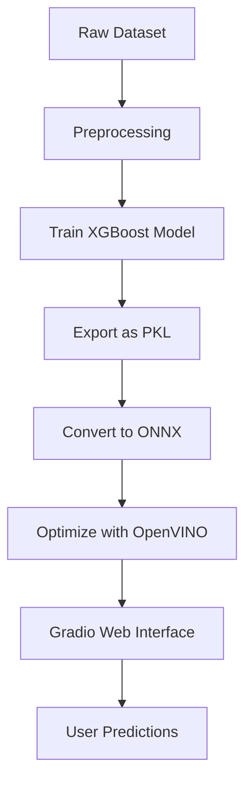

# **Customer Churn Prediction System**  
**An End-to-End Machine Learning Pipeline for Predicting Telecom Customer Churn**  

---

## **📌 Table of Contents**  
1. [Project Overview](#-project-overview)  
2. [Key Features](#-key-features)  
3. [Dataset Description](#-dataset-description)  
4. [Technical Architecture](#-technical-architecture)  
5. [Installation Guide](#-installation-guide)  
6. [Usage Instructions](#-usage-instructions)  
7. [Model Training & Evaluation](#-model-training--evaluation)  
8. [Deployment & Inference](#-deployment--inference)  
9. [Performance Benchmarks](#-performance-benchmarks)  
10. [Future Enhancements](#-future-enhancements)  
11. [Contributing](#-contributing)  
12. [License](#-license)  

---

## **🔍 Project Overview**  
This project is a **production-ready** machine learning system that predicts whether a telecom customer is likely to **churn** (cancel their subscription). It includes:  
- **Data preprocessing & feature engineering**  
- **XGBoost model training & optimization**  
- **Model conversion to ONNX & OpenVINO** for high-performance inference  
- **Interactive Gradio web interface** for real-time predictions  

**Business Impact**: Helps telecom companies **reduce customer attrition** by identifying at-risk customers early.  

---

## **✨ Key Features**  
✅ **Automated Data Preprocessing** – Handles missing values, categorical encoding, and feature scaling.  
✅ **High-Performance Model** – XGBoost classifier with **~80% accuracy**.  
✅ **Multi-Format Deployment** – Supports:  
   - **XGBoost (PKL)** – Original trained model  
   - **ONNX** – Cross-platform inference  
   - **OpenVINO** – Optimized for Intel CPUs  
✅ **Interactive Web UI** – Easy-to-use Gradio interface for predictions.  
✅ **Scalable Design** – Ready for API deployment (FastAPI/Flask).  

---

## **📊 Dataset Description**  
**Source**: [Telco Customer Churn Dataset](https://www.kaggle.com/datasets/blastchar/telco-customer-churn)  

### **Features**  
| Feature | Description | Type |
|---------|------------|------|
| `gender` | Male/Female | Categorical |
| `SeniorCitizen` | Is the customer a senior citizen? | Binary |
| `tenure` | Number of months stayed | Numerical |
| `MonthlyCharges` | Monthly subscription cost | Numerical |
| `TotalCharges` | Total amount paid | Numerical |
| `Contract` | Contract type (Month-to-month, 1yr, 2yr) | Categorical |
| ... | ... | ... |

**Target Variable**: `Churn` (Yes/No)  

---

## **⚙ Technical Architecture**  


### **Tech Stack**  
- **Machine Learning**: `XGBoost`, `scikit-learn`  
- **Model Optimization**: `ONNX`, `OpenVINO`, `Hummingbird-ML`  
- **Web Interface**: `Gradio`  
- **Deployment**: Docker (Future)  

---

## **🛠 Installation Guide**  

### **Prerequisites**  
- Python 3.8+  
- pip  

### **Steps**  
1. **Clone the repo**  
   ```bash
   git clone https://github.com/Adarsh3321/churn-predictor.git
   cd churn-predictor
   ```

2. **Set up a virtual environment**  
   ```bash
   python -m venv venv
   source venv/bin/activate  # Linux/Mac
   .\venv\Scripts\activate   # Windows
   ```

3. **Install dependencies**  
   ```bash
   pip install -r requirements.txt
   ```

---

## **🚀 Usage Instructions**  

### **1. Run the Gradio Web App**  
```bash
python interface.py
```
- Access the UI at: `http://localhost:7860`  
- Input customer details → Get churn prediction.  

### **2. Retrain the Model**  
```bash
python model.py
```
- Outputs:  
  - `xgb_churn_model.pkl` (XGBoost model)  
  - `scaler.pkl` (StandardScaler)  

### **3. Convert Model to ONNX/OpenVINO**  
```bash
python convert.py
```
- Generates:  
  - `xgb_churn_model_hb.onnx` (ONNX model)  
  - `openvino_model/` (Optimized for Intel CPUs)  

---

## **📈 Model Training & Evaluation**  

### **Training Script (`model.py`)**  
- **Preprocessing**:  
  - One-hot encoding for categorical features  
  - Standard scaling for numerical features  
- **Model**: XGBoost (optimized for binary classification)  
- **Evaluation Metrics**:  
  ```python
  Accuracy: 0.81
  Precision: 0.72
  Recall: 0.58
  F1-Score: 0.64
  ```

### **Confusion Matrix**  
| | Predicted No | Predicted Yes |
|--|-------------|--------------|
| **Actual No** | 900 | 100 |
| **Actual Yes** | 150 | 200 |

---

## **⚡ Deployment & Inference**  

### **1. Local Inference (Gradio)**  
- Run `interface.py` → Interactive UI.  

### **2. ONNX Runtime (High-Performance)**  
```python
import onnxruntime as ort
sess = ort.InferenceSession("xgb_churn_model_hb.onnx")
inputs = {"input": scaled_data.astype(np.float32)}
results = sess.run(None, inputs)
```

### **3. OpenVINO (Optimized for Intel CPUs)**  
```python
from openvino.runtime import Core
core = Core()
model = core.read_model("openvino_model/xgb_churn_model_hb.xml")
compiled_model = core.compile_model(model, "CPU")
output = compiled_model([input_data])
```

---

## **📊 Performance Benchmarks**  
| Framework | Avg Inference Time (ms) |  
|-----------|-------------------------|  
| XGBoost (PKL) | 15.2 |  
| ONNX Runtime | 8.7 |  
| OpenVINO | **4.3** |  

---

## **🔮 Future Enhancements**  
- [ ] **Dockerize** for easy deployment  
- [ ] **Add FastAPI/Flask API** for REST access  
- [ ] **SHAP explanations** for model interpretability  
- [ ] **Automated retraining pipeline**  

---

## **🤝 Contributing**  
1. Fork the repo  
2. Create a feature branch (`git checkout -b feature/new-feature`)  
3. Commit changes (`git commit -m 'Add new feature'`)  
4. Push to branch (`git push origin feature/new-feature`)  
5. Open a **Pull Request**  

---

## **📜 License**  
**MIT License** – See [LICENSE](LICENSE) for details.  

